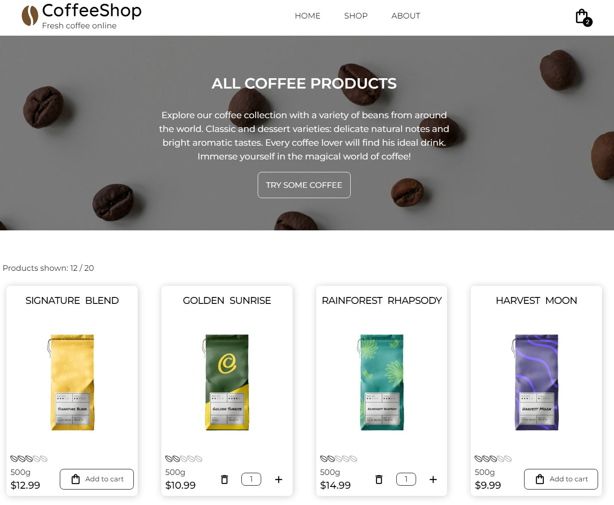

# Shopping Cart

### **Description**

A mock-up of an e-commerce website that sells coffee beans. The website utilizes an external API for fetching data about products and offers basic cart functional with local storage.

#### 🔗 [Live preview](https://coffeeshop-house.netlify.app)



### **Features**

- Product cart: add, remove and set quantity of a given product
- Infinite scrolling: scroll down the shop page to load all products

### **Built With**

- React
- Redux Toolkit
- React Router
- TypeScript
- Tailwind
- Material UI
- Vite

#### 🔗 [Fake Coffee API](https://fake-coffee-api.vercel.app)

### Installing and running

```bash
git clone https://github.com/Dimar1510/shopping-cart.git
cd shopping-cart
npm install
npm run dev
```
